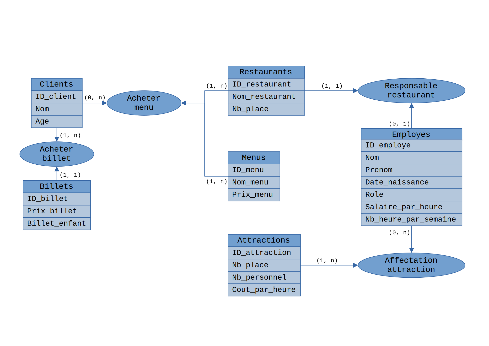
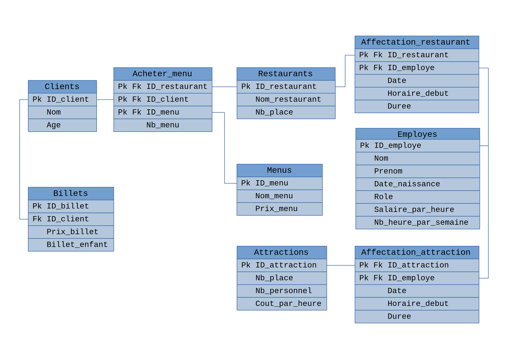

# New Super Bolcheland

## Introduction

Nous aurons les tables:

- Clients
- Employes
- Billets
- Restaurants
- Menus
- Acheter_menu
- Attractions
- Affectation_attraction

### Clients

Primary key : ID_client

Clients(<ins>ID_client</ins>, Nom, Age)

|   Clients   |
|-------------|
| ID_client |
| Nom |
| Age |

### Employes

Primary key : ID_employe

Employes(<ins>ID_employe</ins>, Nom, Prenom, Date_naissance, Role, Salaire_par_heure, Nb_heure_par_semaine)

|   Employes   |
|--------------|
| ID_employe |
| Nom|
| Prenom |
| Date_naissance | 
| Role |
| Salaire_par_heure |
| Nb_heure_par_semaine |

### Billets

Primary key : ID_billet  
Foreign key : ID_client

Billets(<ins>ID_billet</ins>, #ID_client, Prix_billet, Billet_enfant)

|   Billets   |
|-------------|
| ID_billet |
| ID_client |
| Prix_billet |
| Billet_enfant |

### Restaurants

Primary key : ID_restaurant  
Foreign key : ID_employe

Restaurants(<ins>ID_restaurant</ins>, #ID_employe, Nom_restaurant, Nb_place)

|   Restaurants  |
|----------------|
| ID_restaurant |
| ID_employe |
| Nom_restaurant |
| Nb_place |

### Affectation_restaurant

Primary keys : ID_restaurant ; ID_employe  
Foreign keys : ID_restaurant ; ID_employe

Affectation_restaurant(#<ins>ID_restaurant</ins>, #<ins>ID_employe</ins>, Date, Horaire_debut, Duree)

|   Affectation_restaurant   |
|----------------------------|
| ID_restaurant |
| ID_employe |
| Date |
| Horaire_debut |
| Duree |

### Menus

Primary key : ID_menu

Menus(<ins>ID_menu</ins>, Nom_menu, Prix_menu)

|   Menus   |
|-----------|
| ID_menu |
| Nom_menu |
| Prix_menu |

### Acheter menu

Primary keys : ID_restaurant ; ID_client ; ID_menu  
Foreign keys : ID_restaurant ; ID_client ; ID_menu

Acheter_menu(#<in>ID_restaurant</ins>, #<ins>ID_client</ins>, #<ins>ID_menu</ins>, Nb_menu)

|   Acheter menu   |
|------------------|
| ID_restaurant |
| ID_client |
| ID_menu |
| Nb_menu |

### Attractions

Primary key : ID_attraction

Attractions(<ins>ID_attraction</ins>, Nb_place, Nb_personnel, Cout_par_heure)

|   Attractions   |
|-----------------|
| ID_attraction |
| Nb_place |
| Nb_personnel |
| Cout_par_heure |

### Affectation attraction

Primary keys : ID_attraction ; ID_employe  
Foreign keys : ID_attraction ; ID_employe

Affectation_attraction(#<ins>ID_attraction</ins>, #<ins>ID_employe</ins>, Date, Horaire_debut, Duree)

|   Affectation_attraction   |
|----------------------------|
| ID_attraction |
| ID_employe |
| Date |
| Horaire_debut |
| Duree |

## Schémas

### Schéma Entité-Association

### Schéma relationnel

